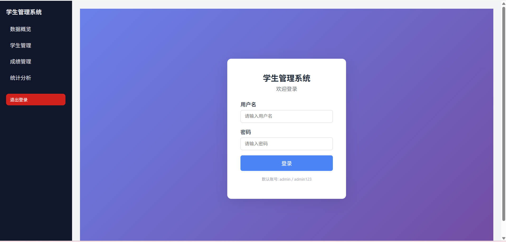
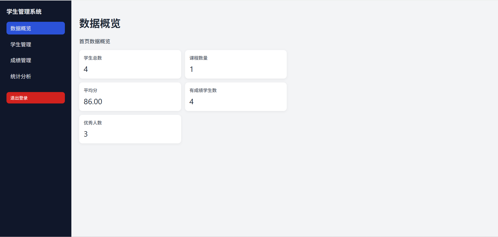
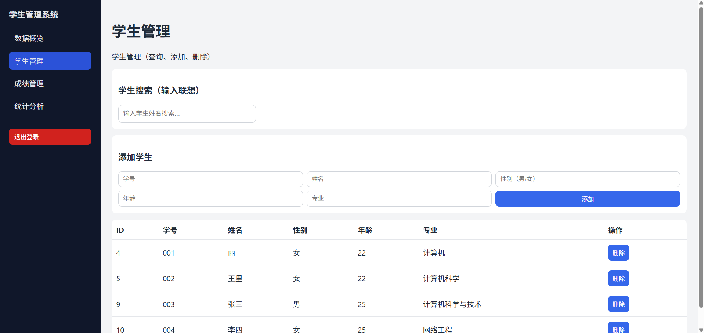
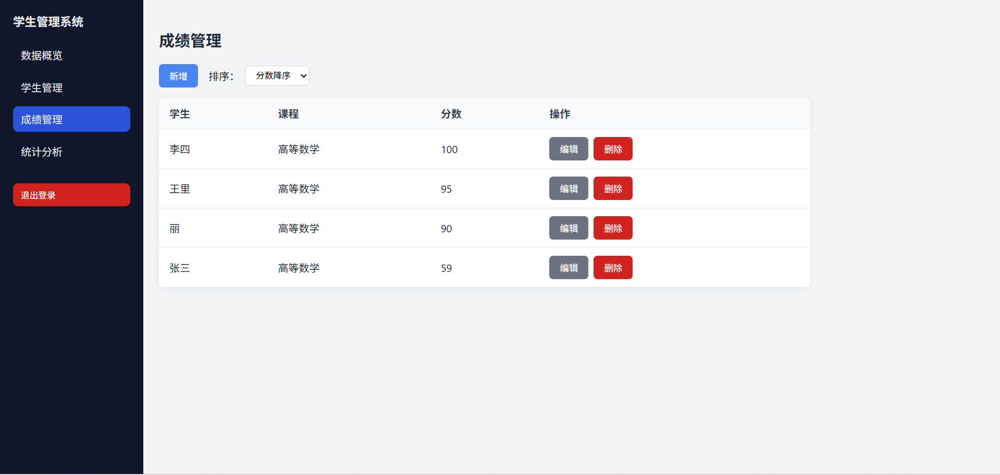
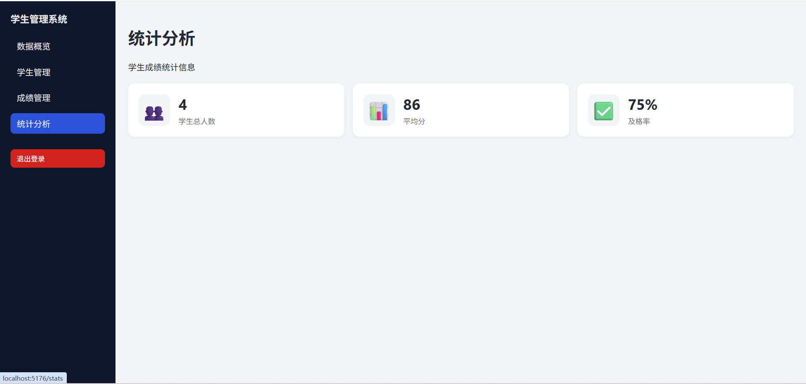

# Student Management (前后端分离)

## 项目结构

```text
student_management/
  backend/   # Flask API
  frontend/  # Vue3 + Vite
```

## Backend 启动

```bash
cd backend
python -m pip install -r requirements.txt
python app.py
```

后端默认地址：
- `http://127.0.0.1:5000`

## Frontend 启动

```bash
cd frontend
npm install
npm run dev
```

前端默认地址（Vite）：
- `http://127.0.0.1:5173`

## 对接说明

- 前端 API 基础地址在 `frontend/src/api/http.js`
- 当前配置：`http://127.0.0.1:5000`
- Students 页面已接入：
  - 获取学生列表：`GET /api/students`
  - 添加学生：`POST /api/students`
  - 删除学生：`DELETE /api/students/<id>`
## 项目截图

### 登录页面


## 数据概览


### 学生管理页面


### 成绩管理页面


### 统计分析页面


## 项目说明

本项目为基于 **Vue3 + Vite + Flask** 的学生成绩管理系统，用于实现学生信息管理、成绩管理与统计分析等功能。

系统采用前后端分离架构，通过 RESTful API 进行数据交互，实现了数据的增删改查与实时展示。
- 实现学生信息的统一管理
- 支持成绩录入与排序功能
- 提供数据统计与可视化分析
- 熟悉前后端分离开发流程
- 掌握 GitHub 项目管理流程

---

##  核心功能

### 学生管理
- 学生信息增删改查
- 学生姓名模糊搜索
- 输入联想功能

### 成绩管理
- 成绩列表展示
- 分数升序 / 降序排序
- 后端数据排序实现

### 统计分析
- 学生总人数统计
- 平均分计算
- 及格率分析

### 系统功能
- 前后端分离架构
- RESTful API 接口设计
- 数据实时交互

---

## 技术栈

- 前端：Vue3 + Vite + Axios
- 后端：Flask + SQLAlchemy
- 数据库：MySQL 
